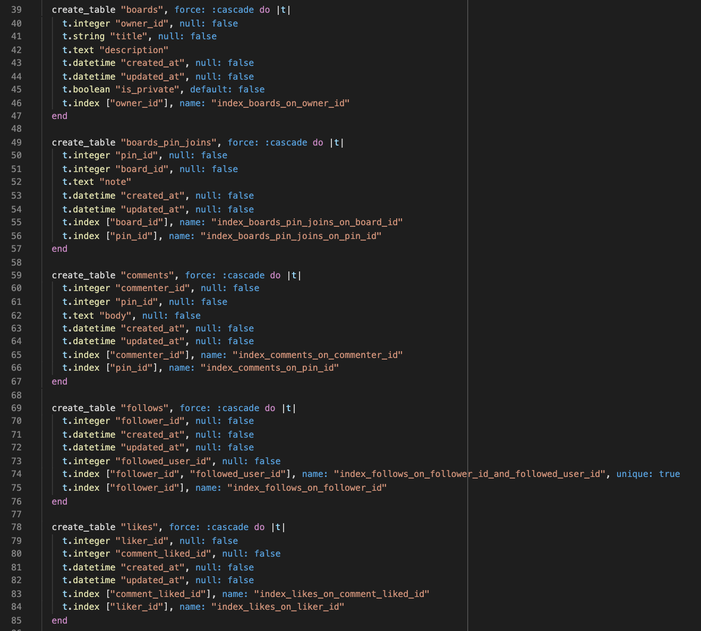
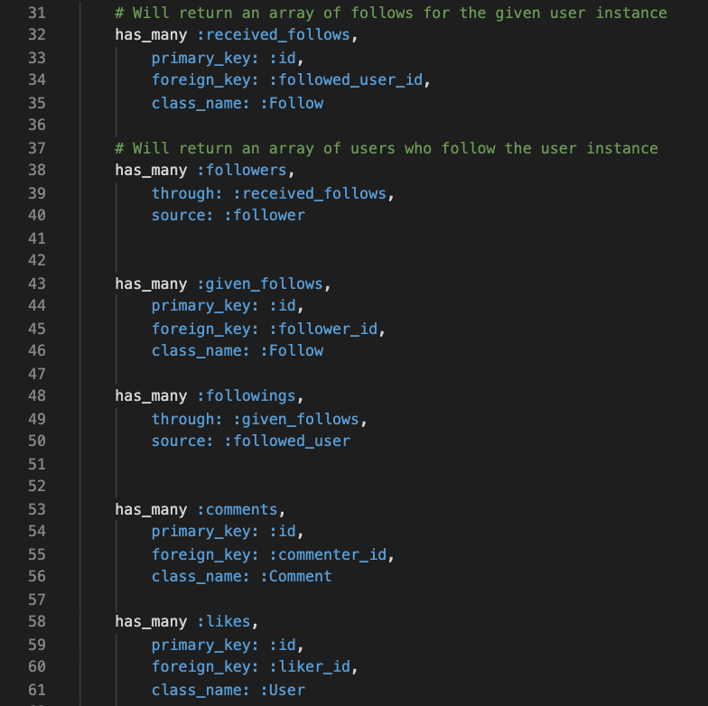

# **Pininit** - [Live Link](https://pininit.herokuapp.com/#/)

## *By Joseph Sipiorski* 
 

# Overview of Pininit

Pininit is a fullstack project, a clone of the common social media platform Pinterest. The features implement in this clone allow users to create personal accounts, follow other accounts, create boards and pins, as well as edit account information such as username, and profile image. On a user's home feed all posts created by users they follow will be displayed. Users can also comment on posts and like comments. Although this clone replicates much of Pinterest's core functionality there are still many more features of Pintrest that will be added.
___

___

## App Architecture & Technologies

Because of the user specific information, relating to followings, a lot of the logic involved in rendering this information happens on the backend, specifically through rails associations. This allows for easy access to a logged in user's follower's, following's, boards, pins associated with said boards, home feed, as well as much more. The frontend's primary functionality is rendering and retrieving this user specific information in an organized and efficient manner, in addition to the styling that replicates Pinterest.

The backend is Ruby on Rails with a PostgreSQL data base, while the front end is primarily React Redux with SCSS and some HTML.

### Below is a part of the the schema
___

# Frontend Overview
## React

React can account for the primary functionality of the front end. React allows for a lot of the interactive functionality experienced when loading and navigating around Pininit. It allowed for an extremely fluid and simple means to create the reactive functionality, primarily through JSX and specifically the advantages provided by delegating specific functionality to independent components. Without React creating an extensively dynamic application such as Pininit, would be much more costly, in that React allows for the update of specific parts of state directly. 

## Redux

Redux allowed for an extensive amount of functionality in changing what is displayed on screen quickly, this is done primarily through functions that are mapped to props that allow click, and such events, to trigger the update of backend data and subsequently displayed frontend data through the reducers. A user's information initially loaded and stored on the front end which is then used to allow for a quick and interactive experience with the specific user's information.

# Backend Overview

## Ruby on Rails 

Because of the amount of user dependent data for each session it made perfect sense to utilize the rails association to link user's to their followers, boards and pins as well as their pins to their boards. This provided a very convenient means of pulling associated data to the frontend during user sessions. 

### Below are some of the association for users
___

## AWS s3
Amazon Web Services S3 was used to store images uploaded by users for pins as well as user profile images.

## PostgreSQL
The rails back end retrieved and wrote to the PostreSQL data base through Active Record Queries, making use of both rails model association and PostreSQL table to inform the frontend during user sessions. 

## Conclusion & Next Steps

Pininit was initially a very daunting project, however, during the process i became intimately familiar with the technologies and really started to appreciate the structure and advantages that React Redux provides. After working so much with React Redux specifically i've find myself running back of my older code and optimizing it, making components more independent, DRY, as well as expandable. It's been a satisfying and addicting journey. 

I hope to continue my work on this clone to both optimize my existing code base as well as expand it, my plans to expand will include providing re-pin functionality as well as user direct messaging, in addition to many of the other features native to Pinterest. 
